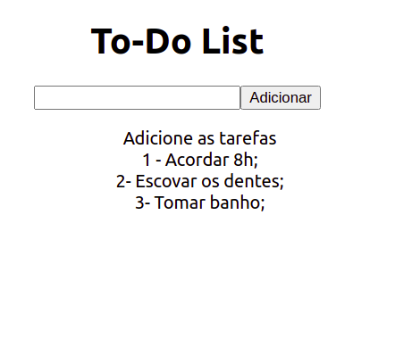

<h1 align="center">   To-Do-List-React ⚛️ 📋 ✔️  <h1> 
  

  

#### Para utilizar:  

Clone esse repositório. Você vai precisar ter instalado o `node` e `npm`. Instale de forma global. 

<h3>Instalação: </h3>

`npm install`  

<h4>Iniciando o servidor: </h4>

`npm start`  

<h4>Para ver o app no navegador: </h4>

`localhost:3000`  

<h4>Para ver o app de outras máquinas que estejam na mesma rede: </h4>

` ip da máquina + porta ` 

` exemplo: 192.168.0.200:3000` 

